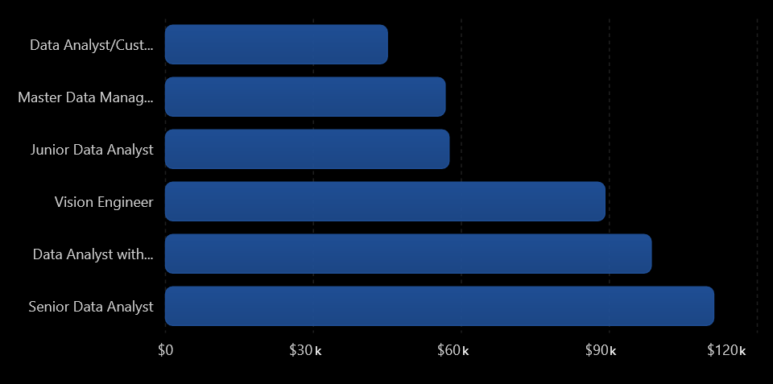
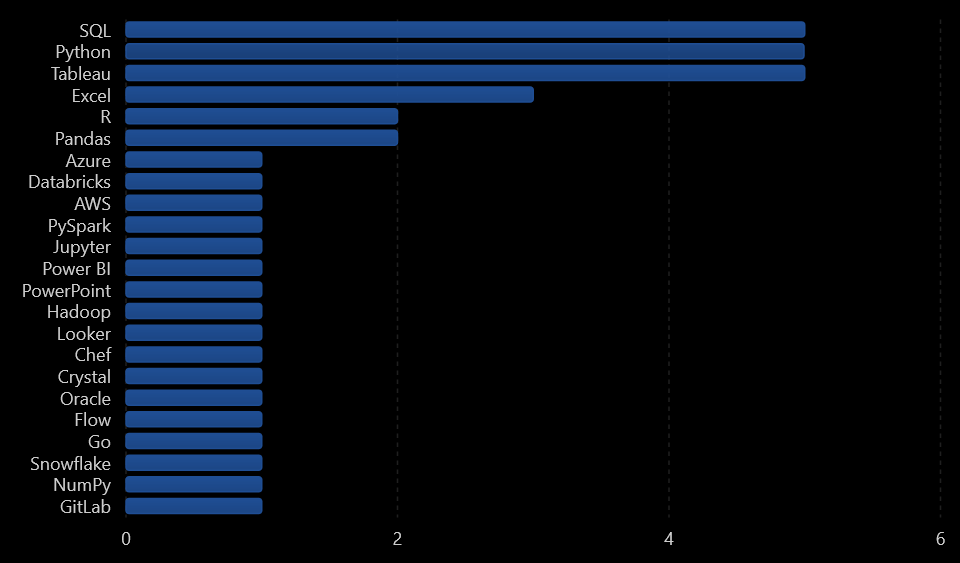
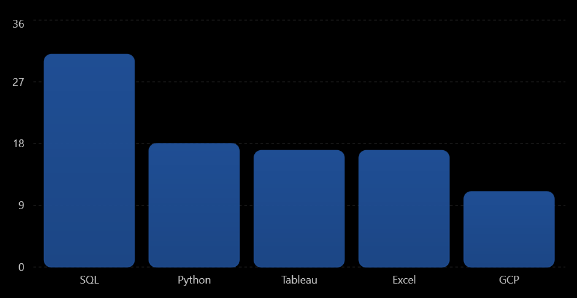

# Introduction
This project explores the Data Analyst job market in Poland using SQL. The goal was to identify the most in-demand skills, analyze salary trends, and discover which technologies are associated with the highest-paying opportunities. By querying a real-world dataset of job postings, I gained practical experience in data exploration and SQL-based analysis.

Check out the SQL queries used in this project: [project_sql folder](/project_sql/)
# Background
The demand for Data Analysts continues to grow, making it important to understand which skills employers value the most. This project focuses on the Polish job market and answers questions such as:

- Which Data Analyst positions offer the highest salaries?
- What skills are most frequently required?
- Which skills are associated with the highest average salaries?
- How do skill demand and salary relate to each other?
# Tools I Used
- **SQL** – for querying, filtering, aggregating, and analyzing the dataset.
- **PostgreSQL** – as the database management system.
- **Visual Studio Code** – for writing and organizing SQL queries.
- **Git & GitHub** – for version control and project documentation.
# The Analysis
The project consists of several SQL queries designed to examine different aspects of the Data Analyst job market in Poland.

### 1. Newest job postings in Kraków
Retrieves the latest analyst job postings in Kraków that include salary information. It shows the company name, job title, location, schedule type, salary, and the exact posting date and time. The results are sorted from the most recent postings and limited to the top 10 entries.
```sql
SELECT
    name AS comapny_name,
    job_title,
    job_location,
    job_schedule_type,
    salary_year_avg,
    job_posted_date::date AS date,
    job_posted_date::time AS time,
    job_id
FROM
    job_postings_fact
    LEFT JOIN company_dim ON job_postings_fact.company_id = company_dim.company_id
WHERE
    job_title_short ILIKE '%Analyst%'
    AND job_location ILIKE '%Kraków%'
    AND salary_year_avg IS NOT NULL
ORDER BY
    date DESC
LIMIT 10
```
<br>
*Bar chart showing the five most recent data analyst job postings in Kraków; ChatGPT generated this graph from my SQL query results.*
### 2. Highest-paying remote analyst jobs and required skills
First identifies the 10 highest-paying remote analyst jobs and stores them in a CTE. It then joins those jobs with the skills tables to show which technologies are required for each role. As a result, it highlights both the best-paid remote positions and the skills associated with them.
```sql
WITH top_paying_jobs AS (
    SELECT
        job_id,
        job_title,
        salary_year_avg,
        name AS comapny_name
    FROM
        job_postings_fact
        LEFT JOIN company_dim ON job_postings_fact.company_id = company_dim.company_id
    WHERE
        job_title_short ILIKE '%Analyst%'
        AND job_work_from_home IS TRUE
        AND salary_year_avg IS NOT NULL
    ORDER BY
        salary_year_avg DESC
    LIMIT 10
)

SELECT
    top_paying_jobs.*,
    skills
FROM 
    top_paying_jobs
    INNER JOIN skills_job_dim ON top_paying_jobs.job_id = skills_job_dim.job_id
    INNER JOIN skills_dim ON skills_job_dim.skill_id = skills_dim.skill_id
ORDER BY
    salary_year_avg DESC
```

<br>
*Bar graph visualizing the highest-paying remote analyst jobs and required skills; ChatGPT generated this graph from my SQL query results.*
### 3. Most in-demand skills for Data Analysts in Poland
Finds the most frequently required skills in Data Analyst job postings in Poland. It counts how many times each skill appears across the dataset and sorts the results from the most in-demand to the least. The output is limited to the top 5 skills.
```sql
SELECT 
    skills,
    COUNT(skills_job_dim.job_id) AS demand_count
FROM 
    job_postings_fact
    INNER JOIN skills_job_dim ON job_postings_fact.job_id = skills_job_dim.job_id
    INNER JOIN skills_dim ON skills_job_dim.skill_id = skills_dim.skill_id
WHERE
    job_title_short ILIKE '%Data Analyst%'
    AND job_location ILIKE '%Poland%'
GROUP BY
    skills
ORDER BY
    demand_count DESC
LIMIT 5
```
| Skill    | Demand Count |
|----------|--------------|
| sql      | 1765         |
| excel    | 1261         |
| python   | 1080         |
| tableau  | 809          |
| power bi | 721          |

*Table of the most in-demand skills for data analysts in Poland.*
### 4. Highest-paying skills for Data Analysts in Poland
Calculates the average yearly salary for each skill in Data Analyst job postings in Poland. It only includes jobs with salary data available and ranks the skills from the highest average salary to the lowest. The result helps identify which technologies are associated with the best-paying roles.
```sql
SELECT 
    skills,
    ROUND(AVG(salary_year_avg), 2) AS avg_salary
FROM 
    job_postings_fact
    INNER JOIN skills_job_dim ON job_postings_fact.job_id = skills_job_dim.job_id
    INNER JOIN skills_dim ON skills_job_dim.skill_id = skills_dim.skill_id
WHERE
    job_title_short ILIKE '%Data Analyst%'
    AND salary_year_avg IS NOT NULL
    AND job_location ILIKE '%Poland%'
GROUP BY
    skills
ORDER BY
    avg_salary DESC
LIMIT 25
```
| Skill | Avg Salary |
|-------|------------|
| linux | 165000.00 |
| mongo | 165000.00 |
| aws | 165000.00 |
| hadoop | 133750.00 |
| nosql | 131750.00 |
| sheets | 111175.00 |
| bigquery | 111175.00 |
| snowflake | 111175.00 |
| sas | 111175.00 |
| jira | 111175.00 |
| airflow | 109729.17 |
| windows | 109729.17 |
| spark | 107250.00 |
| tableau | 107248.65 |
| flow | 106837.50 |
| looker | 104777.50 |
| azure | 103800.00 |
| scikit-learn | 102500.00 |
| git | 100590.00 |
| qlik | 100137.50 |
| rust | 98500.00 |
| c++ | 98500.00 |
| matplotlib | 98500.00 |
| unix | 98500.00 |
| python | 95669.72 |

*Table of the highest-paying skills for data analysts in Poland.*
### 5. Most in-demand and highest-paying skills for Data Analysts in Poland
Combines skill demand and salary analysis for Data Analyst jobs in Poland. For each skill, it calculates how often it appears in job postings and what the average salary is, but only keeps skills that appear more than 10 times. The results are then sorted by demand and salary, making it easier to identify skills that are both popular and well paid.
```sql
SELECT
    skills_dim.skill_id,
    skills_dim.skills,
    COUNT(skills_job_dim.job_id) AS demand_count,
    ROUND(AVG(salary_year_avg), 2) AS avg_salary
FROM
    job_postings_fact
    INNER JOIN skills_job_dim ON job_postings_fact.job_id = skills_job_dim.job_id
    INNER JOIN skills_dim ON skills_job_dim.skill_id = skills_dim.skill_id
WHERE
    job_title_short ILIKE '%Data Analyst%'
    AND salary_year_avg IS NOT NULL
    AND job_location ILIKE '%Poland%'
GROUP BY
    skills_dim.skill_id
HAVING
    COUNT(skills_job_dim.job_id) > 10
ORDER BY
    demand_count DESC,
    avg_salary DESC
LIMIT 25
```
<br>
*Bar chart illustrating the most in-demand and highest-paying skills among data analysts in Poland; ChatGPT generated this graph from my SQL query results.*<br><br>
The findings show that SQL remains the core skill for Data Analysts, while Python and Tableau are also highly valued. Technologies related to cloud computing and big data, such as AWS, Azure, and Hadoop, tend to be associated with higher salaries, suggesting that employers increasingly value advanced technical skills alongside traditional analytics expertise.
# What I Learned
Through this project, I strengthened my practical SQL skills by working with a relational database and solving real analytical problems. I gained experience using:

- **JOINs** to combine multiple tables.
- **Aggregate** functions such as COUNT() and AVG().
- **Filtering** data with WHERE and HAVING.
- **Common Table Expressions** (CTEs).
- **Sorting** and **ranking** results using ORDER BY and LIMIT.
- **Transforming raw data** into meaningful business insights.

I also improved my ability to interpret query results and present analytical findings in a clear and structured way.
# Conclusions
### Insights
The analysis demonstrates that SQL remains the foundation of the Data Analyst role in Poland, while Python, Tableau, and cloud-related technologies significantly increase a candidate's competitiveness in the job market. Additionally, skills associated with data engineering and cloud platforms are often linked to higher salaries, reflecting the growing demand for analysts with broader technical expertise.
### Closing Thoughts
Overall, this project highlights how SQL can be used not only to retrieve data but also to generate actionable insights about labor market trends and employer requirements.